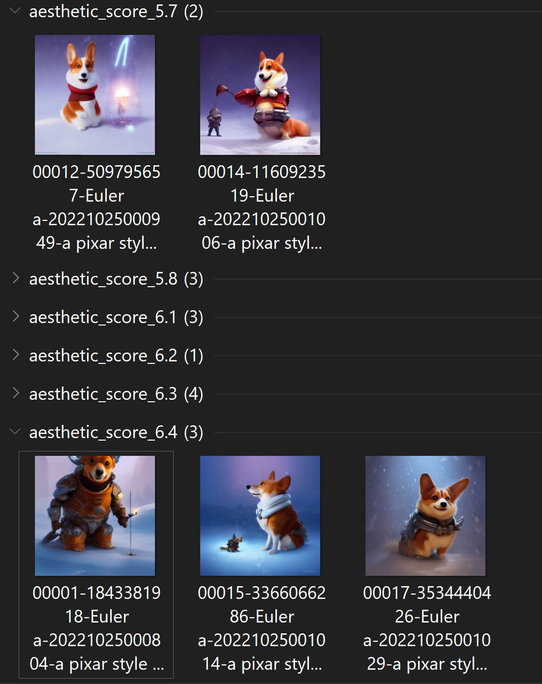
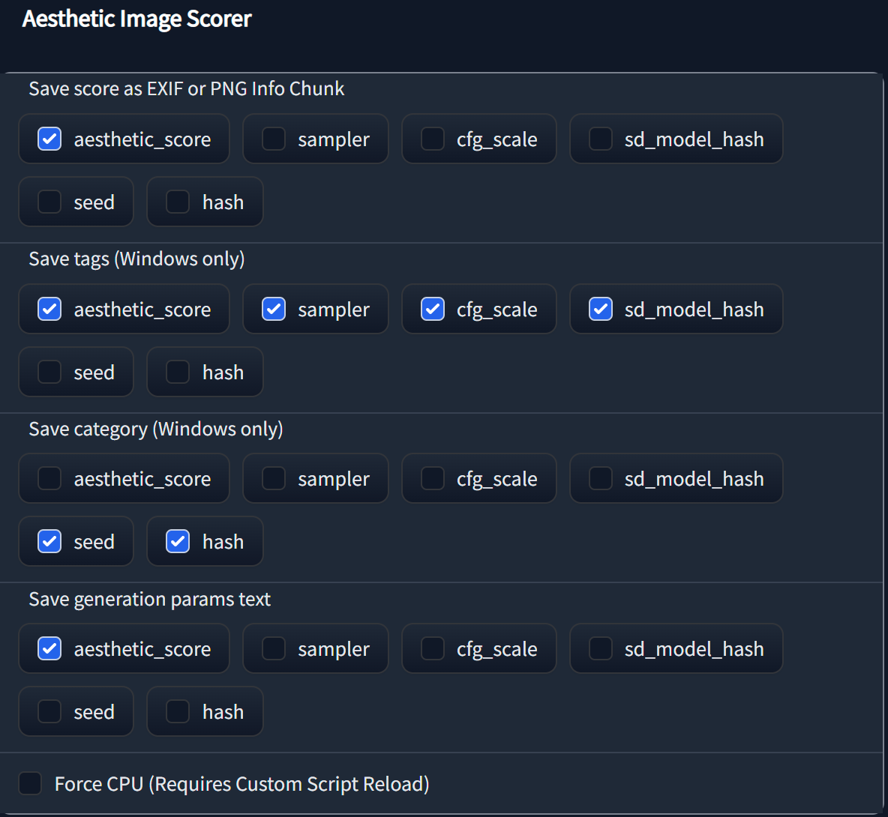

# Aesthetic Image Scorer

Extends aesthetic image scorer with a hill climbing score optimiser, which can be found in the script dropdown.

To use this optimiser fill in the prompt and negative prompts, then write down a selection of prompts (preferably a good amount, at least 15 or so) in either the dropdown or a prompts.csv file in your SD folder. The optimiser will iteratively attempt to improve the average score of output images by randomly adding tags from the list.

Try to find settings and base prompt that doesn't generate too many black squares first.
Black squares muck up the average score calculation, and while they're filtered, they will still significantly alter the outcome unless batch count is very high.

I recommend using at least a batch count of 10 and as many steps as you have patience for for good general-purpose results. Single batch count optimisation is also possible with decent results, but will require a good amount of prompts.

Batch count determines how many images it generates per step, Steps determines how many times it should look for a tag that improves score.

A log with all prompts and average scores can be found in the log folder. There is no sane way to display the info in webui itself.

Currently, only greedy hill climbing and some related siblings (stochastic, random-restart) are included. Memory-assisted hill climbing, simulated annealing, genetic algorithms, generation parameters might be included sometime in the future(?)™




Extension for https://github.com/AUTOMATIC1111/stable-diffusion-webui

Calculates aestetic score for generated images using [CLIP+MLP Aesthetic Score Predictor](https://github.com/christophschuhmann/improved-aesthetic-predictor) based on [Chad Scorer](https://github.com/grexzen/SD-Chad/blob/main/chad_scorer.py)

See [Discussion](https://github.com/AUTOMATIC1111/stable-diffusion-webui/discussions/1831)

Saves score to windows tags with other options planned

## Installation
Clone the repo into the `extensions` directory and restart the web ui:

```commandline
git clone https://github.com/tsngo/stable-diffusion-webui-aesthetic-image-scorer extensions/aesthetic-image-scorer
```

or use the `Extensions` tab of the webui to `Install from URL`

```commandline
https://github.com/tsngo/stable-diffusion-webui-aesthetic-image-scorer
```


To upgrade do:

```commandline
git pull
```

or use `Extensions` tab to upgrade.

After restarting the ui, see settings for options

## Features

- Save aesthetic score and other things
    - `hash` is a md5 hash of prompt, negative prompt, dimensions, steps, cfg scale, seed, model hash (experimental). Don't rely on this. 
    - rest should be obvious
- Save as EXIF or PNG Info Chunk (Only PNG Chunk Info currently)
- Save as tag (Windows Only)
    - Added to tags as `aesthetic_score_5.9`
    - JPG supports by default. PNG tags requires a 3rd party software like [File Meta](https://github.com/Dijji/FileMeta/releases). Here is a [walkthrough](https://www.thewindowsclub.com/enable-tags-for-unsupported-files-windows) to add tagging for unsupported filetypes.
- Save as category (Windows Only)
- Save as generation parameter text
- Run prediction using CPU

## FAQs
- If you want to add score to existing images, try running Extra->Batch from directory without upscaling. The new images will get the score.
- If seeing this error `Aesthetic Image Scorer: Unable to write tag or category`
    - Make sure you're using the latest webui and this extension
    - If still seeing this, post your settings from the settings page, your OS and whether you're saving PNG or JPG
- If seeing this error `Aesthetic Image Scorer: Unable to load Windows tagging script from tools directory`
    - Check if the tools directory has add_tags.py
